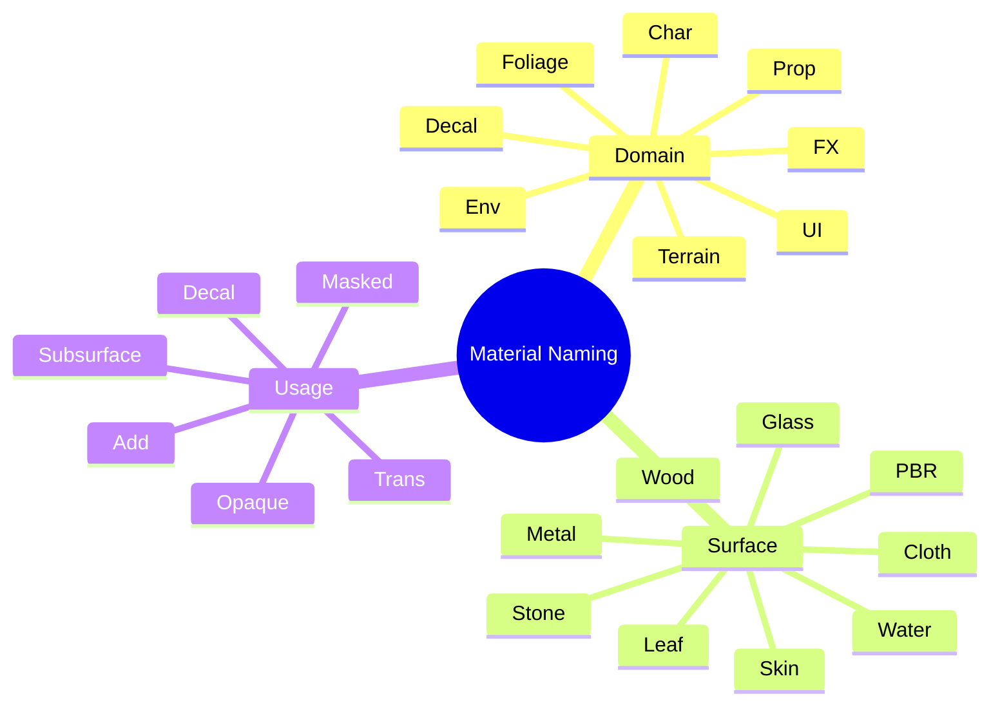

# 3D Game Development — Unreal Materials
## Naming Convention (Domain • Surface • Usage)

> A concise naming scheme for Unreal materials that keeps search/filter fast and consistent. 

---

## Learning outcomes

By the end of this guide, you will be able to:

- Apply a **three-field** naming convention to Master Materials and Material Instances.
- Choose clear values for **Domain**, **Surface**, and **Usage** to improve searchability.
- Keep visual/technical **variants** out of names and inside parameters, folders, or collections.

---

## Field glossary (pick one per field)

**Domain** — where it’s used  
`Env` (environment) · `Prop` · `Char` · `Foliage` · `FX` · `Decal` · `UI` · `Terrain`

**Surface** — what it is  
`PBR` (generic) · `Metal` · `Wood` · `Stone` · `Glass` · `Water` · `Skin` · `Cloth` · `Leaf`

**Usage** — how it shades  
`Opaque` · `Masked` · `Trans` (translucent) · `Add` (additive) · `Subsurface` · `Decal`

---

## Good examples

### Masters (`MM_…`)
- `MM_Env_PBR_Opaque`
- `MM_Env_Stone_Opaque`
- `MM_Foliage_Leaf_Masked`
- `MM_Water_Water_Trans`
- `MM_Char_Skin_Subsurface`
- `MM_Prop_Wood_Opaque`

### Instances (`MI_…`)
- `MI_Env_PBR_Opaque`
- `MI_Env_Stone_Opaque`
- `MI_Foliage_Leaf_Masked`
- `MI_Water_Water_Trans`
- `MI_Char_Skin_Subsurface`
- `MI_Prop_Wood_Opaque`

---

## Workflow & rules

1. Name the **Master** once, keep it stable.  
2. Create **Instances** for assets/variants—do **not** add asset names to the instance name; organize with folders/tags.  
3. No spaces; use `_`. Keep names short; most important info first: **Domain → Surface → Usage**.  
4. Encode technical flags (e.g., triplanar, packed ORM) as **parameters/functions**, not in the name.

---

## Quick sanity check

- Can you tell **where** it’s used (Domain)?  
- Can you tell **what** it is (Surface)?  
- Can you tell **how** it shades (Usage)?  
 
If “yes” to all three, the name is good.

---

## Mindmap



---

## Material Prefix & Suffix Conventions

To maintain readability and quick filtering in Unreal Engine’s Content Browser, always use **prefixes** to identify asset type.  These prefixes help separate master materials, instances, and functions at a glance.

| Prefix | Meaning | Description |
|:--|:--|:--|
| `MM_` | **Master Material** | The base shader containing all parameterized logic. Never modify directly once instances exist. |
| `MI_` | **Material Instance** | A derived material with adjustable parameters (color, roughness, texture maps, etc.). Created from a master. |
| `MF_` | **Material Function** | A reusable logic block (e.g., triplanar projection, packed texture unpacking, UV transforms). Used inside masters. |
| `MTL_` | *(optional)* Material | Sometimes used for single-use leaf materials that don’t need instancing. |
| `MP_` | *(optional)* Material Parameter Collection | Holds shared global parameters (e.g., time, weather, lighting states). |

**Best practice:** Keep the prefix uppercase and separated from the first field with an underscore.  
Avoid suffixes for naming; Unreal primarily uses prefixes for material typing.

**Example hierarchy:**  
```
MF_UV_Triplanar
MF_Math_RemapRange
MM_Env_PBR_Opaque
MI_Env_PBR_Opaque
```

> Use these prefixes consistently across your project so materials always sort and filter predictably in the Content Browser.

---

## The pattern

- **Master Material:** `MM_<Domain>_<Surface>_<Usage>`
- **Material Instance:** `MI_<Domain>_<Surface>_<Usage>`

> Keep it to **three fields only**. Use **parameters**, **folders**, or **tags** for variants (colors, seasons, LQ/HQ).
